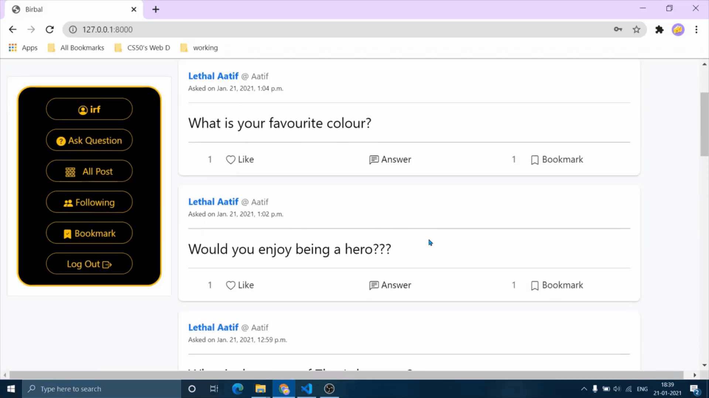
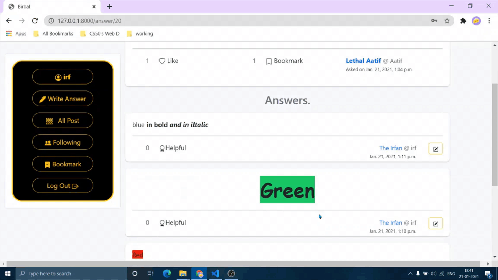

# Ask Birbal.
"Ask Birbal" is a Quora-like question-answer and social network website for asking question, getting answers and following users.

## Overview
Ask Birbal is my final project for Harvard CS50's Web Programming with Python and JavaScript course.
Birbal was one of the nine famous advisor in the court of the Mughal emperor Akbar. He was famous for his wit.

## Project Demos
A [full demo of my project](https://youtu.be/3rz4KYPMFgM) can be viewed on YouTube along with my all [other CS50 Web Projects](https://www.youtube.com/playlist?list=PL6kIwIV_2O_gfcx46gplsaybo8c9vTb3d).

Note the quality of the following clips may be lower due to conversion from video to GIF format.  

### Question Asked.

### Answer and texteditor.

### Interactive Buttons.
 **Bookmark**
 **Like**
 **Helpful**

### Profile.

## Bug Reports and Improvements
If you experience any bugs or see anything that can be improved or added, please feel free to [open an issue](https://github.com/IrfanTheDev/Ask-Birbal/issues) <!-- update the link --> here or simply contact me through any of the methods below.
 Thanks in advance!

Email: theirfan2020@gmail.com   
Linkedin: [https://www.linkedin.com/in/theirfanr/](https://www.linkedin.com/in/theirfanr/)

